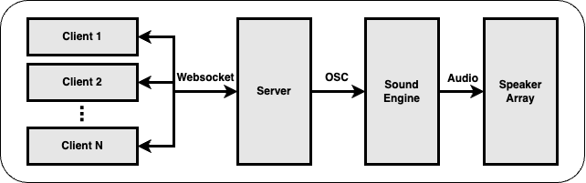

# Spaton

🚨 Check [here](https://zeyuyang42.github.io/Spaton/) for complete documentations

@Generated by DALL·E 3 in ChatGPT

-----

**Spaton** is the combination of **spatial** and **baton**. The idea behind **Spaton** is to use the sensors in mobile phone to control spatial audio compositions. The system supports multi-user connections and has the potential to be used in large-scale interactive sound installations.

This is also as the final project of the Spatial Audio course in TUB so there are some code explaination in details. If you simply want to use this project, it's ok to ignore the Implementation section.

Many thanks to **Luzie Ahrens**, who originally proposed this idea.

## 1. System Design

### 1.1 Signal Flow

The users enter the website and then each log in as a client of Spaton system. The clients communicate with the server to get a role in the interactive composition. Then the clients send their sensor data to the server. The server summarizes all the sensor data from clients and broadcasts OSC messages to the sound engine. The sound engine generates or manipulates the sound based on the coming OSC messages and distributes the sound to the speaker array.

### 1.2 Tech Stack

The Client & Server are developed based on javascript libraries. The Client part was written in [React](https://react.dev/) and the Server relies on[ Express.js](https://expressjs.com/). [socket.io](https://socket.io/) is the tool fo full duplex connection between the clients and the server. The server broadcasts [OSC](https://en.wikipedia.org/wiki/Open_Sound_Control) messages with help of the [osc.js](https://github.com/colinbdclark/osc.js/) library. 

For now, there is no specific Sound Engine for the Spaton system. As long as the Sound Engine is capable of 

- Receive OSC Messages. 
- Generate audio signals (for sure).
- Do spatial panning

The demo I created uses [Max/MSP](https://cycling74.com/products/max) with the [Spat](https://forum.ircam.fr/projects/detail/spat/) library from IRCAM. There are still many other options like [Reaper](https://www.reaper.fm/), [IEM Plugins](https://plugins.iem.at/), [Supercollider](https://supercollider.github.io/) etc.

The tests were holded in the [TU Studio](https://www.tu.berlin/ak/einrichtungen-services/tu-studio/geschichte-des-tu-studios) where equips a 21 channel ambisonic speaker array setup.

## 2. Sensors

There are two types of sensor events supported for now namely [deviceorientation](https://developer.mozilla.org/en-US/docs/Web/API/Window/deviceorientation_event) and [devicemotion](https://developer.mozilla.org/en-US/docs/Web/API/Window/devicemotion_event). For each event there are three parameters.

`deviceorientation`: alpha, beta, gamma

`devicemotion`: x, y, z

Please check the [Web doscs](https://developer.mozilla.org/en-US/docs/Web/API/Device_orientation_events/Orientation_and_motion_data_explained) for further explainations. More interesting events can be derived from these basic events, like the dection of mobile phone shake.

Support for more sensor events are considered.

## 3. Code Structure

-  **client: ** the implementation code of the client part
-  **server: ** the implementation code of the server part
-  **patches: ** spatial audio compositions

## 4. Test Environment

This project was tested by myself using **Chrome** and **iPhone 10**. Currently there is no guarantee that it will work in other browsers and mobile phone models. 

