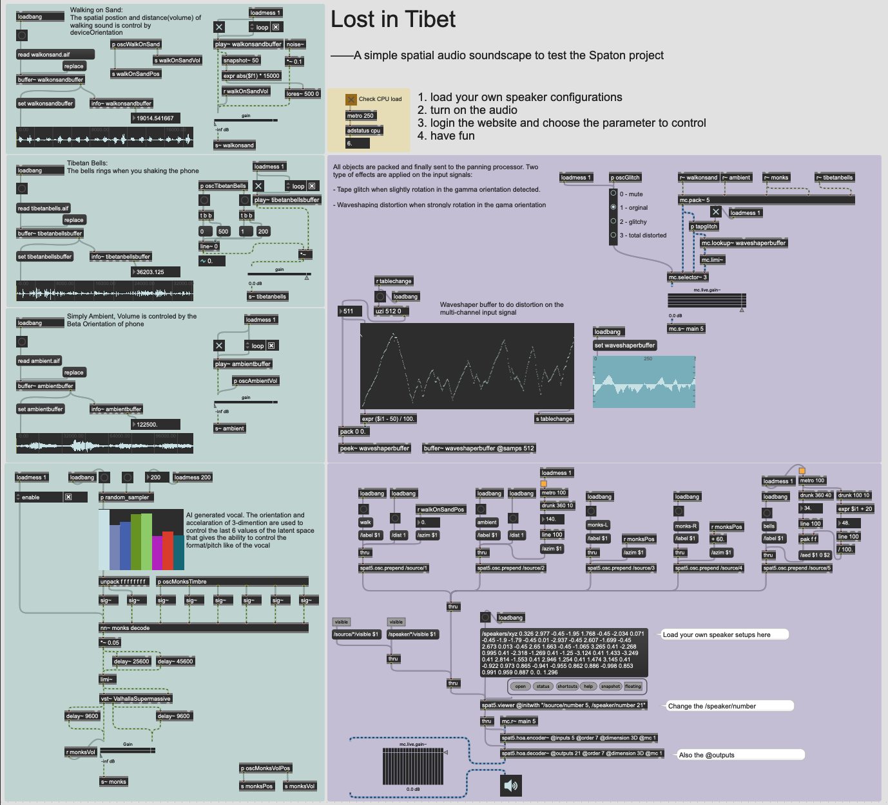

# Demonstrations

## 1. Lost in Tibet

This is a very simple spatial soundscape I created to test the Spaton project. Besides the samples and Max patch, you still need extra files to run it. 

- **ValhallaSupermassive.vst:** It's hard to find a good reverb effect in Max. You can download it free from the [VALHALLA](https://valhalladsp.com/shop/reverb/valhalla-supermassive/). You need to put the `ValhallaSupermassive.vst` file in the patch folder if the system vst folder doesn't add to search path
- **nn~:** Make sure you have [nn~](https://github.com/acids-ircam/nn_tilde) external install. You need to put the`nn~.mxo` in the patch folder if you don't want to put in to the default Max external folder
- **monks.ts:** The Rave model to be loaded by the nn~ external. You can find the download page [here](https://acids-ircam.github.io/rave_models_download). The original name is `VCTK.ts`. Please change it to `monks.ts` and put it into the same folder of the patch.

Max/MSP Screenshot

@Generated by DALL·E 3 in ChatGPT
