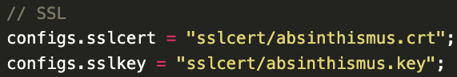
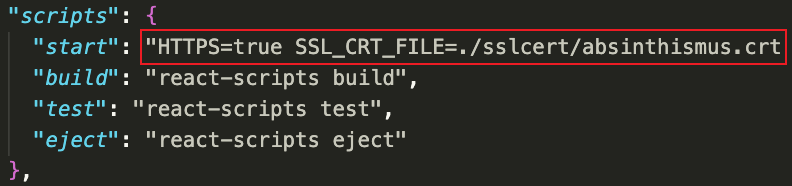
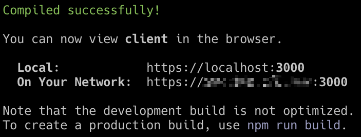
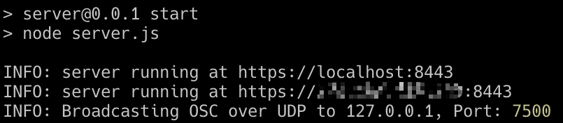

# Installation

## 1. Install npm & node.js

Since the whole project is based on web technologies. Please make sure you have [node.js](https://nodejs.org/en) and  [npm](https://www.npmjs.com/) installed. Please check the [npm Docs](https://docs.npmjs.com/downloading-and-installing-node-js-and-npm) to get started with the `Nearest Phase Modulator`:)

## 2. Get the projects

Simply clone the [Spaton source code](https://github.com/zeyuyang42/Spaton) to your local machine.

```bash
git clone git@github.com:zeyuyang42/Spaton.git
cd Spaton
```

## 3. Create your own SSL certificate

All sensor Web-API works only under https, SSL certificate are required to establish secure https connection. I recommend using [OpenSSL](https://www.openssl.org/) to get a self-signed SSL certificate. There is a good [reference guide](https://www.digitalocean.com/community/tutorials/openssl-essentials-working-with-ssl-certificates-private-keys-and-csrs#generating-ssl-certificates). Or you can just follow the instruction below.

```bash
mkdir sslcert
cd sslcert
openssl genrsa -out ${anynameyoulike}.key 2048 # generate private key
openssl req \  
       -newkey rsa:2048 -nodes -keyout ${anynameyoulike}.key \
       -x509 -days 365 -out ${anynameyoulike}.crt # generate certificate
cd ..
cp -r sslcert/ server/sslcert # copy the sslcert to server 
cp -r sslcert/ client/sslcert # copy the sslcert to client
```

## 4. Install packages

Run `npm install` in server and client folder. 

## 5. Change configs

### 5.1 Certificate

Change the name of key and certificate if you don't use the name `absinthismus`.

**Server:** 

change the sslcert and sslkey configure in the `configs.js` file.



**Client:**

Change the scirpt/start configure in the `package.json` file.



### 5.2 IP

Change the `configs.serverIP` and `configs.clientIP` in each of the two `configs.js` files on the client and server from your current LAN IP.

### 5.3 Others

You can customise the system to suit your composition. This part is elaborated in the **Usage** section.

## 6. Launch

Run `npm start ` to start server and client. You should see the following outputs when nothing goes wrong :)

**Client:**



**Server:** 

