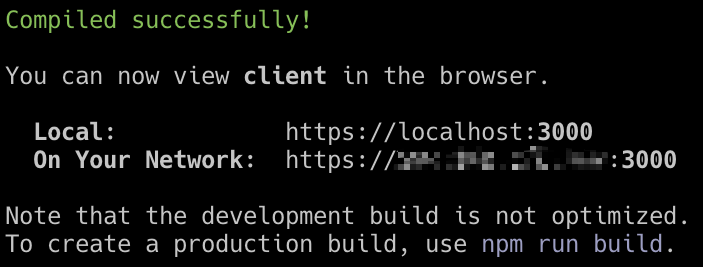

# Usage

Ensure that you have completed the installation process and are able to successfully launch the client and server.

## 1. Client Interaction

### 1.1 Connection

Make sure your phone is in the same network with the servers (Maybe just your Laptop in this early stage). View the Client in the Browser according to the following url. Please don't use the localhost. 



🚨 There would be a security warning from the brower for the first time login. Since we are using a self-signed ssl certificate instead of being issued by an trusted authority. You can ignore this and keep logging in if you believe in yourself :)

### 1.2 UI

The Client UI looks as follow. The main functional parts are the listed route cards. Each route card represents a route for the client to choose. Blue cards are still available route. Red cards are choosen by this client. Grey cards with strikethrough means these routes are already occupied by other clients. Each route requires a list of sensor data. One client can choose multiply routes together.


## 2. Demo Listening

You can experience the Spaton system using the demo patch I created. Take look at the **Lost in Tibet** in the patches folder for guidance of how to set it up.

## 3. Presets

### 3.1 Example

Sure you will soon get bored if Spaton is only capable of supporting one specific composition. Luckily you can create presets for your own compositions. The route cards in the client UI are created orignally based on the preset data provided by the server looks as follow. Take a look at the Details section for better understanding (Later). 

```json
[
  {
    "id": 1,
    "name": "ambientVol",
    "events": [2],
    "occupied": false,
    "client": "undefined"
  },
  {
    "id": 2,
    "name": "walkOnSand",
    "events": [1, 2],
    "occupied": false,
    "client": "undefined"
  },
  {
    "id": 3,
    "name": "monksTimbre",
    "events": [1, 2, 3, 4, 5, 6],
    "occupied": false,
    "client": "undefined"
  },
  {
    "id": 4,
    "name": "tibetanBells",
    "events": [4, 5, 6],
    "occupied": false,
    "client": "undefined"
  },
  {
    "id": 5,
    "name": "glitch",
    "events": [3],
    "occupied": false,
    "client": "undefined"
  },
  {
    "id": 6,
    "name": "monksVolPos",
    "events": [1, 2],
    "occupied": false,
    "client": "undefined"
  }
]
```

### 3.2 Create Preset

You can create and use your own preset file. The preset files saved in the `presets` folder inside `server` folder where you can add your own json files.

#### 3.2.1 JSON Fields

Each route card is defined using the same fields:

`id`: serial id of route card as identifier

`name`: the name to display on the route card

`events`: The list of mobile phone sensor events in this route. See **Events** section for details

`occupied`: indicator for whether the route has been occupied

`client`: save the client id if route is occupied

#### 3.2.2 Events

The numbers in the events list of preset json present different sensor parameters. These are defined in the `WebEvents.js` file inside the `client`. Please check the code for complete fields. The basic fields listed as below:

| Id   | Event             | Parameter |
| ---- | ----------------- | --------- |
| 1    | deviceorientation | alpha     |
| 2    | deviceorientation | beta      |
| 3    | deviceorientation | gamma     |
| 4    | devicemotion      | x         |
| 5    | devicemotion      | y         |
| 6    | devicemotion      | z         |

### 3.3 Use Preset

To start the server with a specific preset file, please set the `configs.presetAddress` in the `configs.js` of the server. 

## 4. OSC messages

🚨 The OSC message formation is far from satisfied. It is going to be modified/improved in the following version!

The address pattern of OSC message is formatted in the structure of :

/`${routeName}`/`${parameterName} `

e.g The route **walkOnSand** requires the events 1 and 2, which is the alpha and beta of device orientation event. The formatted message head looks like: 

`/walkOnSand/alpha`

`/walkOnSand/beta`

While the argument is the original orientation value along this axis without scale. You can receive OSC messages according to these address in the sound engine and use it to complete your composition.

## 5. Spatialization

I won't give any tutorial of how to make spatial audio composition. But there are some basic ideas I tried and thought of when playing with the mobile phone sensors. 

- Use the deviceorientation parameters to control the sound object position
- Use the devicemotion to control the moving speed of object
- Use the not with spatialisation connected parameter to control other sound parameters 
- Shake the mobile phone to spatial granularize a material. (Tried, but my spatial granular patch is too computational inefficient )
- ...


